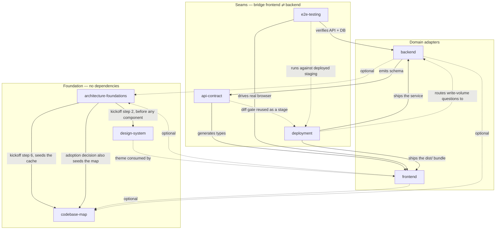
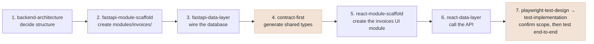

# Full-Stack Engineering Plugins — Guide

The `kaizen-plugins` marketplace includes a
set of eight plugins that teach Claude consistent conventions for building,
testing, and shipping full-stack applications — with deep support for React and
FastAPI, and thin architecture adapters for Vue, Angular, Node.js, NestJS,
Django, and Java/Kotlin. This document explains what each plugin actually does,
how it gets triggered, how the plugins connect to each other, and how to turn
them on in a real project.

> **Renamed:** these plugins previously shipped from marketplaces called
> `kaizen-local-tools`, `kaizen-fullstack-plugins` and `kaizen-TS-plugins`. If
> your plugins suddenly went quiet after updating, that's why — `enabledPlugins`
> keys are `plugin@marketplace`, so entries like `"frontend@kaizen-local-tools"`
> no longer match anything. Replace the old name with `kaizen-plugins`
> throughout your `settings.json` (both the `extraKnownMarketplaces` key and
> every `enabledPlugins` entry) and they come back.

---

## 1. The mental model (read this first)

Three concepts, not to be confused:

| Term | What it is |
|---|---|
| **Plugin** | A folder under `plugins/technical-delivery/` in this repo (`frontend/`, `backend/`, ...). The unit you enable/disable in a project's settings. Bundles a `plugin.json`, a `README.md`, and one or more skills. |
| **Skill** | A single `SKILL.md` file inside a plugin's `skills/` folder. The actual unit of behavior — a focused set of instructions Claude follows for one kind of task (e.g. "write React tests," "scaffold a FastAPI module"). |
| **Marketplace** | This whole repo, registered once via `.claude-plugin/marketplace.json`, listing every plugin available to install. |

**Enabling is per-plugin, not per-skill, and happens once per project.** A
project's `.claude/settings.json` lists which plugins are turned on
(`"frontend@kaizen-plugins": true`). Turning a plugin on gives access to
*every* skill inside it — there's no separate step to enable
`react-testing` vs `react-routing`.

**Invocation is automatic, not manual commands.** Every `SKILL.md` has a
`description` ending in a list of trigger phrases ("Use when the user says
things like..."). In normal use, nobody types a command — you just describe
what you want ("add a route," "write tests for this hook," "review this
endpoint") and Claude matches your phrasing against every enabled skill's
description and picks the right one. An explicit `/plugin:skill` form also
exists (e.g. `/frontend:react-testing`) if you want to force a specific
skill instead of relying on auto-match.

**Nothing runs automatically in your app.** A plugin is instructions Claude
reads, not a runtime dependency. Enabling one adds zero code to your
project. Real files only get created/edited at the moment you actually ask
Claude to do something, and only inside your project — never inside this
marketplace repo.

---

## 2. Setup — enabling this marketplace

There are two levels this can live at, and the difference matters.

### The default: user level (`~/.claude/settings.json`)

Enable the marketplace once on your own machine and every project you open gets
it. Nothing is written into any repo — no `.claude/` directory, no `CLAUDE.md`.
This is the recommended path, and it's what `project-kickoff` assumes: that skill
deliberately writes **nothing** into a project's `.claude/`, because which
plugins a developer has enabled is their configuration, not a property of the
code.

```json
{
  "extraKnownMarketplaces": {
    "kaizen-plugins": {
      "source": { "source": "github", "repo": "kaizenanalytix/kaizen-claude-plugins" }
    }
  },
  "enabledPlugins": {
    "architecture-foundations@kaizen-plugins": true,
    "codebase-map@kaizen-plugins": true,
    "design-system@kaizen-plugins": true,
    "frontend@kaizen-plugins": true,
    "backend@kaizen-plugins": true,
    "api-contract@kaizen-plugins": true,
    "e2e-testing@kaizen-plugins": true,
    "deployment@kaizen-plugins": true
  }
}
```

No npm/pip install, no build step. The next session sees the skills immediately —
except hooks, which register at install time (see §7).

### Optional: project level, committed (`<repo>/.claude/settings.json`)

Only worth doing when you want **teammates** to get these plugins automatically
on clone, instead of each person configuring their own machine. Copy
`templates/project-settings.json` into the repo's `.claude/settings.json`, trim
`enabledPlugins` to what that repo actually is (a backend-only service doesn't
need `frontend` or `design-system`), and commit it.

Two cautions before you do:

- **The `github` source must actually exist and be readable by your team.**
  Until this marketplace is pushed there, a teammate who clones gets an
  unresolvable marketplace and none of the skills.
- **Never commit a `file` source.** An absolute local path resolves on exactly
  one machine. It's correct in your own `~/.claude/settings.json` and wrong in a
  shared repo.

### What you'll see in a repo either way

`.claude/settings.local.json` may appear in a project — **Claude Code creates
that itself** when you approve a permission. It's personal, gitignored, and
nothing to do with these plugins.

---

## 3. The eight plugins, end to end

### 3.1 `architecture-foundations` — Tier 1, no dependencies

Framework- and stack-agnostic principles that `frontend` and `backend` both
build on. No library-specific code, nothing runnable — pure concepts that a
framework adapter later translates into concrete terms.

| Skill | Purpose |
|---|---|
| `clean-architecture` | The three-zone model (core/modules/shared), the one-way dependency rule, spotting silent module-level duplication — framework-independent. |
| `ui-architecture` | The three-zone model applied to a UI app specifically, in framework-neutral vocabulary (presentation units, composers, a logic layer). `frontend-architecture` is the React translation of this. |
| `state-philosophy` | Server-state vs. client-state, caching/invalidation, optimistic updates — as concepts, no specific library. |
| `test-pyramid` | Unit/integration/e2e proportions and what belongs at each layer, independent of tooling. `react-testing`, `fastapi-testing`, and `e2e-testing` are the tool-specific implementations of this. |
| `working-agreement` | How work gets done, independent of stack. **Four rules:** finish all edits *then* ask before any build/lint (and run them together once approved); surface pre-existing problems near a change rather than silently fixing them; recommend a model tier at decision points; and never assume an implementation detail — read the repo's existing technical docs first, and ask about anything they don't pin down. Shipped as a `SessionStart` hook, not just a skill — a skill loads when its description matches, which is too late for a rule about what not to do mid-task. |
| `project-kickoff` | **Greenfield orchestrator.** Owns the first hour of a new project: asks stack/product shape/design source as explicit options, applies the design system *before* any component exists, then the framework bootstrap, the architecture skeleton, the API contract, and seeds the `codebase-map` cache after the first commit. Two of its steps run as **background sub-agents** rather than in this conversation — see §4's note on orchestration. Deliberately writes **nothing** into the project's `.claude/` directory and creates no `CLAUDE.md` — plugin enablement is user-level config, not a scaffolding decision. |
| `existing-codebase-adoption` | The brownfield counterpart to `project-kickoff`. Decided once per discipline per project: does a codebase that already has its own structure adopt Kaizen's conventions, or keep its own? Recorded in `.kaizen/adoption.json`, keyed per discipline, so a repo can be `frontend: kaizen` and `backend: existing` at once. Also **triggers `codebase-map-sync`** as part of its own run, so going through this decision always leaves the project mapped. **Enforced by a hook** — see the callout below. |

**Trigger it with:** "structure the app," "where should this state live,"
"what should I test," "start a new project," "this project already has a
frontend/backend," "should I run the build."

`working-agreement` is the exception to "invocation is automatic" — its
`SessionStart` hook puts the rules in context every session whether or not
anything triggers the skill, because a rule about what *not* to do mid-task is
useless if it only arrives once someone asks about it.

**The two doors into a project.** `project-kickoff` and
`existing-codebase-adoption` are mutually exclusive per discipline — greenfield
enters through the first, pre-existing code through the second, and each hands
to the other when it finds it was the wrong one. A half-and-half repo (existing
backend, brand-new frontend) uses one per side. The one case that does *not*
bounce between them is a small hand-scaffolded project that skipped kickoff:
`existing-codebase-adoption` owns that directly, so the user isn't handed back
and forth.

### ⚠ This plugin can block an edit

Besides the `SessionStart` hook, this plugin ships a **`PreToolUse` hook**
(`scripts/adoption-gate.js`, matcher `Edit|Write|NotebookEdit`) that will
**refuse an edit** and tell you to run `existing-codebase-adoption` first. If
you see a message like *"Editing src/foo.py touches an existing backend
codebase (N tracked backend files, no .kaizen/adoption.json entry)"*, that's
this — not a bug.

It fires only when **all** of these are true: the file resolves to a discipline
(from the nearest `package.json` / `pyproject.toml` / `pom.xml` / `manage.py`),
the repo has real commit history, that discipline has more than ~20 tracked
files, and `.kaizen/adoption.json` has no entry for it. It **fails open** on
anything else — no discipline resolved, no git repo, no commits yet, a small
scaffold, a non-source file like a README, or any error in the script itself.
So it can only ever block a genuine, non-trivial, undecided existing codebase.

Running `existing-codebase-adoption` once per project and discipline satisfies
it permanently, for that session and every future one.

**Hooks register at install time.** If you edit `hooks/hooks.json` or either
script, reinstall the marketplace or the change won't take effect.

---

### 3.2 `frontend` — Tier 2, one deep adapter plus two thin ones

Builds maintainable, domain-modular UI applications. **React is the deep
adapter** (the eleven `react-*` skills below); **Vue and Angular get thin
adapters** — stack detection and zone routing only, no specialist depth yet.
Depends conceptually on `architecture-foundations` (restates the relevant rule
inline, so it still works if that plugin isn't installed) and optionally on
`api-contract` (generated DTOs) and `codebase-map` (cached facts).

**Next.js needs no adapter of its own** — it's a React meta-framework that
`frontend-architecture`'s Step 1 stack profiling already detects and adapts to.

| Skill | Purpose |
|---|---|
| `frontend-architecture` | **Orchestrator.** Profiles the real stack — meta-framework, router, server-state library, and whether it's a web app at all — then translates `ui-architecture`'s neutral vocabulary into React terms and routes on what it found. Consults `codebase-map` first if installed (Step 0). Gates on `existing-codebase-adoption` for non-greenfield projects. |
| `react-module-scaffold` | Scaffolds a new business-domain module (seven folders: components/pages/hooks/services/store/context/types) and wires it into the store/router. Now also checks `codebase-map` first for the existing module/naming pattern. |
| `react-data-layer` | RTK Query (server state) vs. Redux slice (client state), composed by one custom hook per page. Also checks `codebase-map` first. |
| `react-module-context` | Props vs. module-scoped Context vs. store — the decision rule plus a safe context factory. |
| `react-routing` | Lazy-loaded, typed, auth-protected routes with path constants. |
| `react-testing` | Vitest (unit), RTL + MSW (integration). Covers no browser-driven tests at all — every Playwright test in this marketplace, at any depth, goes through `e2e-testing` instead. **Lists the intended cases in plain language and waits for confirmation before writing any test code.** |
| `react-project-bootstrap` | Greenfield Vite + React + TypeScript setup, with Tailwind and the `app.css` theme in the dependency baseline rather than arriving as a side effect of `shadcn init`. |
| `react-naming-conventions` | File/folder/identifier naming standards per module subfolder. |
| `react-component-library` | Standardizes on shadcn/ui (Radix + Tailwind) for generic UI primitives. |
| `react-component-composition` | When to extract a shared component/hook vs. accept duplication; composition vs. render props. |
| `react-best-practices` | **Review checklist**: Rules of Hooks, purity, memoization, keys, derived state, error boundaries, accessibility. |
| `vite-config-basics` / `vite-env-variables` / `vite-dev-proxy` / `vite-plugins` / `vite-build-output` | Framework-neutral Vite build-tooling group — config shape, `.env` conventions, dev proxy, plugin decisions, build output. `vite-build-output` now defers to the `deployment` plugin for the pipeline and for the build-once-vs-build-per-environment question. |
| `vue-architecture` | **Thin adapter.** Detects Vue (`vue` dep, `.vue` files, `@vitejs/plugin-vue`), routes greenfield vs. existing, and translates the three zones into Vue vocabulary (SFCs, composables, Pinia, `provide`/`inject`). Flags Nuxt as changing routing conventions rather than assuming Vite. No naming/data-layer/testing/bootstrap skills exist for Vue yet — it says so and asks rather than inventing them. |
| `angular-architecture` | **Thin adapter.** Detects Angular (`@angular/core`, `angular.json`), routes greenfield vs. existing, and translates the three zones into Angular vocabulary (presentational components, injectable services, DI scoping). Notes that Angular's own DI hierarchy already *is* the module-scoped-state mechanism, so it doesn't reach for NgRx by default. Same "no specialist skills yet" honesty. |

**Trigger it with:** "structure my frontend," "add a new X module," "call
the API," "add a route," "write tests for this hook," "review this
component," "set up a new React project," "structure my Vue app,"
"where does this Angular code belong."

**Its greenfield default is one specific stack** — Vite + React Router (library
mode) + RTK Query + shadcn/ui + Vitest — and `react-project-bootstrap` builds
exactly that. On an **existing** project that default is not assumed: `react` in
`package.json` says almost nothing, since Next.js apps, React Router
framework-mode apps, and Remotion video projects all have it. So
`frontend-architecture` profiles the real stack first, and `react-data-layer`,
`react-routing`, `react-testing`, and `react-component-library` each check what's
actually installed and translate their rules into it. The architectural rules
(server vs. client state, thin pages, dumb components, one hook per page) are
stack-independent; the library names are not. **None of them will propose
migrating a working app** to RTK Query or React Router — that's its own task.

---

### 3.3 `backend` — Tier 2, one deep adapter plus four thin ones

Builds clean-architecture backends with the same domain-module discipline as
`frontend`. **FastAPI is the deep adapter** (the eight `fastapi-*` skills
below); **Node.js, NestJS, Django, and Java/Kotlin get thin adapters** — stack
detection and zone routing only. Same dependency shape: conceptually depends on
`architecture-foundations`, optionally on `api-contract` and `codebase-map`.

| Skill | Purpose |
|---|---|
| `backend-architecture` | **Orchestrator.** Applies the three-zone model (core/modules/shared) to a FastAPI service and routes to the skill below. Consults `codebase-map` first if installed (Step 0). Gates on `existing-codebase-adoption`. |
| `fastapi-module-scaffold` | Scaffolds a new business-domain module (five folders: domain/schemas/service/infra/api + dependencies.py) and wires it into the app/DI container. Now also checks `codebase-map` first. |
| `fastapi-data-layer` | Repository (persistence, behind a domain-declared interface) → service (orchestration, the only thing routes call) → DI wiring. Also checks `codebase-map` first. |
| `fastapi-routing` | Per-module routers, versioning, auth, route protection. |
| `fastapi-testing` | Pytest unit tests (domain/services w/ fakes), integration tests (async `httpx` client over ASGI + test DB), contract tests (Schemathesis against the OpenAPI schema, with real auth headers injected into every generated case — including a pattern for request-signing middleware, not just `Depends()`-based auth). **Lists the intended cases in plain language and waits for confirmation before writing any test code.** Points cross-stack workflow asks at `e2e-testing`. |
| `fastapi-project-bootstrap` | Greenfield FastAPI project setup (app factory, settings, DI baseline). |
| `fastapi-naming-conventions` | File/class/function naming standards per module subfolder. |
| `fastapi-common-packages` | One vetted package per common need — ORM, migrations, auth, jobs, logging, caching, HTTP client, rate limiting. |
| `fastapi-best-practices` | **Review checklist**: blocking calls in async code, N+1 queries, response models, Pydantic v2 patterns, DI scope, thin routes, pagination, idempotency. |
| `nodejs-architecture` | **Thin adapter.** A generic Node backend — `express`/`fastify` with no Nest and no frontend markers in the same manifest. Applies `clean-architecture`'s three zones; borrows the FastAPI module shape as a *starting suggestion* and says plainly that it's borrowed, not an established Node convention. |
| `nestjs-architecture` | **Thin adapter.** Detects `@nestjs/core` / `nest-cli.json`. Nest's own module + DI system already maps onto the three zones almost without translation, so this skill maps them rather than renaming Nest's file suffixes to match FastAPI's. Notes that provider scopes (`DEFAULT`/`REQUEST`/`TRANSIENT`) are already the module-context answer. |
| `django-architecture` | **Thin adapter.** Detects `manage.py` / `django`. Maps zones onto Django's own app structure rather than forcing `modules/` naming — a Django "app" *is* the module concept under a different name. Explicitly does **not** assume DRF, or a repository layer over the ORM. |
| `java-kotlin-architecture` | **Thin adapter.** Detects `pom.xml` / `build.gradle(.kts)` with `.java`/`.kt` sources; assumes Spring Boot and says so, flagging Micronaut/Ktor/Quarkus as outside what it currently knows. Layering: `Controller → Service → domain`, with `Repository` behind an interface. |

**Trigger it with:** "structure my backend," "add a new module," "add an
endpoint," "wire up the database," "add a route," "write tests for this
service," "review this endpoint," "which package should I use for X,"
"structure my NestJS app," "where does this Django code belong,"
"structure my Spring Boot app."

**On the thin adapters.** All six (two frontend, four backend) do the same
three things and nothing more: confirm the stack from its marker files, route
greenfield vs. existing to the right entry point, and apply the
framework-neutral model. Each one states outright that no naming, data-layer,
testing, or bootstrap skill exists for it yet, and asks the user rather than
inventing a convention — which is exactly what `working-agreement`'s rule 4
requires, and matters most precisely where a skill knows least.

---

### 3.4 `api-contract` — the data-shape seam

The seam between `frontend` and `backend`: a single OpenAPI schema both
sides generate typed code from, so neither imports the other's source and
neither drifts silently. Ships runnable tooling (Python scripts), not just
concepts — that's why it's its own plugin rather than a foundations skill.

| Skill | Purpose |
|---|---|
| `contract-first` | Backend-first (default) vs. schema-first strategy; generates typed DTOs for both sides from one `openapi.json` via `scripts/generate_types.py`; classifies schema changes as additive/breaking via `scripts/diff_schema.py` and can gate CI on it; recommends URL-based versioning. |

**Trigger it with:** "define the API contract," "generate API types," "sync
frontend and backend types," "check for breaking API changes," "set up a CI
diff gate for the API schema."

**Does not** consult `codebase-map` — it operates off the `openapi.json`
artifact directly, not the codebase's file layout, so it doesn't need
structural facts about the repo.

---

### 3.5 `e2e-testing` — the runtime-behavior seam

Also sits between `frontend` and `backend`, but for *behavior* instead of
*schema*: does a real UI action, driven through a real backend and
database, actually produce the business result it claims to? This is the
top of the test pyramid — the fewest, most selective tests, reserved for
workflows where a regression would be a real incident.

| Skill | Purpose |
|---|---|
| `playwright-test-design` | **Asks the user up front** (multiple-choice, not open-ended) how deep to test — critical flows vs. comprehensive — and how much device/browser coverage to include, before doing any exploration. Consults `codebase-map` first if installed (Step 0). Then traces User Action → Frontend → API → Backend → DB → Response → UI chain, prioritizes flows/failure modes, documents scenarios in a standard Test-ID format, and **stops and requires user confirmation of the full scenario list (with tags) before any code gets written.** |
| `playwright-project-structure` | Scaffolds `e2e/{pages,fixtures,api,utils,test-data,auth}/` inside the frontend repo — the one place a browser-driven test lives in this marketplace, owning the `@playwright/test` dependency itself rather than `react-project-bootstrap` — the Page Object Model split, per-role auth `storageState` reuse, a dual base-URL fixture (frontend vs. backend as two distinct origins), a `webServer` convention for bringing both up locally, the Chromium/Firefox/WebKit project matrix, and a responsive/viewport matrix (mobile Chrome, mobile Safari, tablet, desktop). Checks what already exists before creating/overwriting anything. |
| `playwright-test-implementation` | Writes the actual spec: locator priority, auto-waiting assertions, unique per-test data, combining API calls with UI actions, responsive/viewport assertions, error-path coverage, flaky-test root-causing. Redirects to `playwright-test-design` first if scope was never confirmed. |
| `playwright-best-practices` | **Review checklist** for an existing Playwright suite: locator strategy, fixed waits, missing business-result assertions, test independence, page-object misuse, over-mocking, error-path coverage, auth reuse, flaky-test suppression. |

**Trigger it with:** "design test cases for X," "set up Playwright," "write
e2e tests for X," "test the checkout flow end-to-end," "review this e2e
test," "this test is flaky."

**Relationship to `react-testing`/`fastapi-testing`:** not a replacement —
those two still own the wide base of the pyramid (unit/integration tests and
API contract tests, respectively). `react-testing` covers no browser-driven
tests at all: any test needing a real browser, at any depth from a
five-minute smoke check to a full cross-stack workflow, goes through
`e2e-testing` instead — there is exactly one home for Playwright tests in
this marketplace, not a lighter-weight one per plugin.

**Where the suite lives, and how CI runs it:** the suite lives inside the
frontend repo, in a dedicated `e2e/` folder — not a third dedicated repo,
and not the backend repo, which keeps its own independent test suite
(`fastapi-testing`) untouched by this. It reaches the backend purely as an
external HTTP dependency via a fixture bound to its own origin
(`E2E_API_BASE_URL`), distinct from the frontend's own `E2E_BASE_URL`. In CI,
both env vars default to a deployed staging environment rather than a
from-source multi-repo checkout — and neither is ever pointed at production,
since these tests genuinely create and mutate data. See
`playwright-project-structure`'s `references/multi-service-setup.md` for the
full convention.

**All three testing skills gate on the same rule:** the intended cases are
listed in plain language and confirmed by the user *before* any test code gets
written. `playwright-test-design` does it as a formal scenario list with Test
IDs, priorities, and tags, because an e2e suite is expensive to build and
expensive to get wrong. `react-testing` and `fastapi-testing` do it as a short
one-line-per-case list grouped by layer, including an explicit "not covered"
line. Same reasoning at both ends: which cases matter is a judgment call made by
reading code, and code doesn't reveal intent — so a wrong guess produces tests
that pass, look thorough, and assert the wrong thing.

---

### 3.6 `codebase-map` — the shared understanding layer

Discipline-agnostic. Maintains a per-machine cache of codebase structure
facts (stack, modules/routes, naming conventions) plus a one-line-per-file
description tree, refreshed via a git-SHA checkpoint instead of a full
re-read every session. Depends on nothing, in either direction.

| Skill | Purpose |
|---|---|
| `codebase-map-sync` | Bootstraps (with explicit user permission before the first scan) or incrementally refreshes `~/.claude/kaizen/<project-name>/codebase-map.json`. Same-SHA → returns cache as-is, no files read. Advanced-SHA → re-describes only what changed. History rewritten → full reseed. |

**Trigger it with:** "map this codebase," "what's the structure here" — or
implicitly, whenever a consulting skill (below) needs it.

**Who consults it today** (Step 0 in each): `frontend-architecture`,
`backend-architecture`, `react-module-scaffold`, `react-data-layer`,
`fastapi-module-scaffold`, `fastapi-data-layer`, `playwright-test-design`.
`project-kickoff` is the one skill that *writes* to it rather than reading —
it seeds the cache at step 6, right after the initial commit, while the repo is
still a skeleton and the scan is nearly free.
Every other skill in `frontend`/`backend`/`e2e-testing` does its own small,
direct check instead (e.g. `react-testing` just checks `package.json`) —
narrow skills don't need the whole map, only skills that explore existing
code before writing something new or deciding overall structure do.

**When it doesn't apply, and says so instead of improvising:** a project that
already has a hand-maintained structural index (a project-specific skill, or a
`CLAUDE.md` documenting the real structure and conventions) doesn't get a
competing map — the hand-written one is richer and wins any disagreement. Nor
does a repo without git, since the checkpoint *is* a commit SHA. Nor a parent
folder holding several independent repos: map each project from inside it, since
the cache is keyed by the current folder's name.

**Important:** the cache is per-machine (`~/.claude/kaizen/...`), not
committed to the project or shared between teammates — each developer
builds their own on first use. The consuming project's `.claude/settings.json`
needs a permissions entry for `~/.claude/kaizen/**` (already in
`templates/project-settings.json`) since the cache lives outside the repo.

---

### 3.7 `design-system` — Tier 1, the visual foundation

The values every component consumes: type scale, colours, spacing, radius,
shadows, interaction states, breakpoints. Three of its four skills are
framework- **and** CSS-library-agnostic; only `tailwind-theme-setup` names a
library. Depends on nothing.

It exists because of one recurring failure: nothing tells a developer what
font size to use, so they pick one — and so does the next developer. A year
later the app has a dozen near-identical sizes, four blues, and no way to
restyle anything centrally. The fix isn't a style guide, it's making the scale
the only thing available.

| Skill | Purpose |
|---|---|
| `typography-system` | The pixel scale (10→48px) with a semantic name per rung (`text-body`, `text-card-title`, `text-page-title`...), the per-element usage table, four weights, and three font families — Inter (UI), Geist Mono (IDs/codes/technical values), Instrument Serif (branding only, never dashboard content). |
| `design-tokens` | Colour by role rather than appearance (`danger`, not `red`), the 4px spacing scale, radius and shadow rungs, and the four interaction states. Focus rings are treated as a keyboard-accessibility requirement, not a decorative choice. |
| `responsive-breakpoints` | Five tiers — mobile / tablet 768 / laptop 1024 / desktop 1280 / large desktop 1536 — for desktop-primary enterprise apps. Deliberately aligned with `e2e-testing`'s device matrix so CSS and tests can't disagree about where a layout changes. |
| `tailwind-theme-setup` | The adapter: writes the real `app.css` (`@theme` block, light/dark, font loading), ships it as a copy-paste asset, and covers reconciling with `shadcn init`, which writes a competing palette if run in the wrong order. |

**Trigger it with:** "set up the design system," "what font sizes should we
use," "define our colours," "what breakpoints should we support," "set up
Tailwind," "write app.css."

**Timing is the whole point.** These skills run before the first component
exists — `project-kickoff` sequences them at its step 2, ahead of the framework
bootstrap. Every other kickoff step is recoverable later by editing a config
file; this one is undone only by editing every component written before it.

---

### 3.8 `deployment` — the shipping seam

Decides how the app actually ships, then writes the files for it. Cross-cutting
like `api-contract` and `e2e-testing` — it serves either side, and neither owns
it.

**Its defining property: it asks before it writes, and it never assumes a
container.** "Deploy this" is not a request for Docker. A built frontend with
no server code belongs on a CDN; a short stateless job belongs in a function; a
service needing a specific kernel belongs in a baked VM image.

| Skill | Purpose |
|---|---|
| `deployment-strategy` | **Orchestrator, and the only skill here that decides anything.** Asks three questions a non-infrastructure person can answer — what ships / who uses it and how hard / what it does to data — detects the CI platform and existing environments before asking about them, then maps the answers onto a shape (static hosting / PaaS / container on a managed runtime / serverless / container-plus-orchestrator / baked VM) through a table where **every row carries its own "why this, not the others."** Presents a deployment plan — including a mandatory "not covered" section — and **stops**. |
| `container-authoring` | The image, and **only when the shape includes one.** Multi-stage builds, minimal non-root bases with an explicit high UID, layer ordering so dependency installs stay cached, `.dockerignore` (including its secret-leak property), exec-form `CMD` so `SIGTERM` actually reaches the app, readiness-vs-liveness, no secrets in layers or build args, commit-SHA tags rather than `:latest`, and a local-dev compose file. |
| `pipeline-authoring` | The pipeline, for **whichever of five platforms the repo actually uses** — GitHub Actions, GitLab CI, Azure DevOps, Cloud Build, Jenkins. Stages ordered cheapest-first, gates that fail rather than warn, build-once-then-promote, OIDC federation with a least-privilege identity per environment instead of long-lived keys, provenance/signing/SBOM, platform-enforced approval, canary with automatic abort, and a rollback path that's been exercised. |
| `deployment-environments` | The dev/staging/prod contract, on **every** shape including static. What must differ (secret values, URLs, scale, approvers, log verbosity) and what must not (the artifact, the runtime, and the config *keys* — so a missing one fails in dev, not prod). Where secrets live and the three places they leak; expand-then-contract migrations so code can roll back past a schema change; why production data never moves downward; parity as a reliability property. |
| `deployment-best-practices` | **Review checklist** for a setup that already exists, grouped by severity and framed by DORA's four key metrics. Leads with what causes incidents — mutable tags, rebuild-per-environment, an untested rollback, a liveness probe that pings the database, non-backward-compatible migrations, shell-form `CMD`, scaling against a fixed connection-pool ceiling. Includes an explicit **"what not to flag"** list so a small service with a small pipeline isn't written up as a defect. |

**Trigger it with:** "how should we deploy this," "do we need Docker," "should
we containerize," "write a Dockerfile," "run the stack locally," "set up
CI/CD," "how do we roll back," "set up staging," "how do we manage secrets,"
"review our deployment," "we keep breaking prod."

**Two behaviours worth knowing about.** First, on a static-hosting answer,
`container-authoring` is skipped *entirely* — and that's enforced from both
ends, so a static project can't be walked into a Dockerfile from either
direction. Second, when the answer to "what does it do to data" is high-volume
or machine-generated writes, `deployment-strategy` says plainly that **write
volume is an architecture problem before it is a packaging problem** and routes
to `fastapi-data-layer`, `fastapi-common-packages`, and `state-philosophy`
first. No Dockerfile fixes an exhausted connection pool.

**What it deliberately does not generate:** Kubernetes manifests or Helm charts
(dead weight on a managed runtime, and a cluster team's shape to own), DNS, TLS
certificates, CDN accounts, cost estimates, or observability setup. Those are
named in the plan's "not covered" section rather than silently omitted.

---

## 4. How the plugins connect (dependency map)



Reading this: `architecture-foundations`, `codebase-map`, and `design-system`
sit underneath everything and depend on nothing (the dotted arrows are optional
consults, not requirements). The two solid arrows out of
`architecture-foundations` are the exception — they're the `project-kickoff`
sequence, which is the one place a foundation plugin actively drives others in
a fixed order.

`frontend` and `backend` each build on `architecture-foundations` conceptually
and can optionally pull cached facts from `codebase-map`. `design-system` feeds
the frontend its theme, but knows nothing about React — a Vue or plain-HTML app
would consume the same three neutral skills and swap only the adapter.

`api-contract`, `e2e-testing`, and `deployment` all sit *between* `frontend` and
`backend`, but as three different shapes. `api-contract` is a one-way pipeline
(a schema flows in from the backend, types flow out to the frontend).
`e2e-testing` reaches out to both ends at once (drives a real browser on the
frontend side, calls the real API and checks the real database on the backend
side). `deployment` takes each side's build artifact and ships it — the
frontend's `dist/`, the backend's image or bundle — and is the one seam that
consumes the other two rather than just sitting beside them: it reuses
`api-contract`'s schema-diff gate as a pipeline stage instead of writing a
second differ, and it deploys the staging environment that `e2e-testing`'s
suite then runs against. No seam needs another plugin's source code — only the
artifact each side exposes (an OpenAPI schema; a running app; a built bundle).

### A note on orchestration and context

Two of `project-kickoff`'s steps run as **background sub-agents** via the Agent
tool rather than in the main conversation, and the reason is context cost: step
2's four `design-system` skills come to 600+ lines of instructions that the
orchestrating conversation has no reason to hold.

- **Step 2** (design system) — one sub-agent, running the four skills in order,
  returning a short summary.
- **Step 3+4** (bootstrap → architecture skeleton) — merged into one step,
  because that pair is the real unit of work. When the stack is *both*
  frontend and backend, it dispatches **two sub-agents in parallel** (a genuine
  fork/join — neither side reads the other's output at that stage) and waits
  for both before continuing. If either comes back missing or malformed, it
  stops and asks rather than guessing at the missing half.

Everything else stays in the main conversation: steps 0 and 1 need live
judgment and user answers, and the rest are single skill hops where the
round-trip isn't worth it. The rule the plugin follows is *delegate a chain of
two or more mechanical skills; keep anything interactive or single-hop
in-context.*

Every dependency described above is **conceptual and optional, never a hard
requirement** — every skill in this marketplace restates the one relevant
rule from a sibling plugin in a single sentence, so it still works standalone
if that sibling plugin isn't installed. This is a deliberate design rule
followed throughout the repo, not an accident.

A polished, theme-aware version of this diagram (plus the worked-example
flow below, drawn out) is published at:
https://claude.ai/code/artifact/ede24094-d59b-4816-817d-93b7a81c6ae3

---

## 5. Worked example: "Add an invoices feature, end to end"

A realistic multi-plugin request, and which skills actually fire, in order.
This example assumes the project already exists; if it didn't, everything below
would be preceded by **"start a new build"** → `project-kickoff`, which asks
stack/product shape/design source, applies the four `design-system` skills
before anything is scaffolded, runs the two bootstrap skills, lays in the
three-zone skeleton, and seeds `codebase-map` after the first commit — so every
Step 0 below hits a warm cache instead of a cold scan.

1. **"Structure a new invoices feature"** → `backend-architecture` (Step 0:
   checks `codebase-map` for existing modules) → routes to
   `fastapi-module-scaffold` (Step 0: checks `codebase-map` again for the
   existing module pattern) → creates `modules/invoices/`.
2. **"Wire up the database for it"** → `fastapi-data-layer` (Step 0: checks
   `codebase-map`) → repository → service → DI provider → route.
3. **"Define the contract for this endpoint"** → `api-contract`'s
   `contract-first` → backend emits `openapi.json` → types generated for
   both sides.
4. **"Add the invoices UI"** → `frontend-architecture` (Step 0: checks
   `codebase-map`) → routes to `react-module-scaffold` (Step 0: checks
   `codebase-map`) → creates `modules/invoices/` on the frontend, importing
   the generated DTOs from step 3 instead of hand-writing types.
5. **"Call the API and show the list"** → `react-data-layer` → RTK Query
   slice + a custom hook.
6. **"Write tests for the service and the component"** → `fastapi-testing`
   (backend unit/integration) and `react-testing` (frontend unit/integration
   only) — the wide base of the pyramid.
7. **"Design and write end-to-end tests for the full invoice workflow"** →
   `playwright-test-design` (Step 0: checks `codebase-map`; Step 1: **asks
   depth — critical vs. comprehensive — and device/browser coverage as
   options first**) → explores the actual invoices code from steps 1–5 →
   **stops and presents the scenario list, with tags, for confirmation** →
   once confirmed, `playwright-project-structure` (checks what already
   exists first) → `playwright-test-implementation` writes the real spec
   against the real frontend + backend + DB.
8. **"Review the whole thing before merging"** → `react-best-practices` +
   `fastapi-best-practices` (component/endpoint hygiene) +
   `playwright-best-practices` (test-suite hygiene).

Nothing in this flow needs a human to remember which plugin owns which
step — describing the actual ask at each stage is enough for the right
skill to fire.

The same sequence (steps 1–3, 5–6 from the numbered list above, condensed —
step 6's testing and step 8's review are the pyramid's base and are omitted
here to keep the crossing points visible):



Steps 1–3 and 5–6 never leave one side of the boundary. Step 4 is the only
point where the backend's shape reaches the frontend; step 7 is the only
point where anything actually runs both sides together and checks the
database, not just the code — the same two tinted "seam" steps from the
dependency diagram above, appearing exactly where they cross the
frontend/backend boundary.

---

## 6. Quick reference — "I want to..."

| I want to... | Say something like... | Skill |
|---|---|---|
| Know when a build/lint gets run, or what to do with dead code you spot | "should I run the build," "should I fix this while I'm here" | `architecture-foundations` (`working-agreement`) |
| Start a brand-new build, end to end | "start a new project," "bootstrap a new build" | `architecture-foundations` (`project-kickoff`) |
| Set the type scale / font sizes | "what font sizes should we use" | `design-system` (`typography-system`) |
| Define colours, spacing, radius, shadows | "define our colours," "add a design token" | `design-system` (`design-tokens`) |
| Decide responsive behavior | "what breakpoints should we support" | `design-system` (`responsive-breakpoints`) |
| Write the theme file | "set up Tailwind," "write app.css" | `design-system` (`tailwind-theme-setup`) |
| Decide app structure, any stack | "structure the app" | `clean-architecture` |
| Decide frontend structure | "structure my frontend" | `frontend-architecture` |
| Decide backend structure | "structure my backend" | `backend-architecture` |
| Add a new business feature (frontend) | "add a new X module" | `react-module-scaffold` |
| Add a new business feature (backend) | "add a new module/domain" | `fastapi-module-scaffold` |
| Call an API / manage state (frontend) | "call the API," "add a Redux slice" | `react-data-layer` |
| Wire persistence (backend) | "add an endpoint," "wire up the database" | `fastapi-data-layer` |
| Add a route (either side) | "add a route" | `react-routing` / `fastapi-routing` |
| Keep frontend/backend types in sync | "sync frontend and backend types" | `api-contract` (`contract-first`) |
| Write unit/integration tests | "write tests for this X" | `react-testing` / `fastapi-testing` |
| Design what to test for a full workflow | "design test cases for checkout" | `e2e-testing` (`playwright-test-design`) |
| Set up an e2e suite's structure | "set up Playwright" | `e2e-testing` (`playwright-project-structure`) |
| Write the actual e2e test | "write e2e tests for X" | `e2e-testing` (`playwright-test-implementation`) |
| Review a component | "review this component" | `react-best-practices` |
| Review an endpoint | "review this endpoint" | `fastapi-best-practices` |
| Review an e2e suite | "review this e2e test" | `e2e-testing` (`playwright-best-practices`) |
| Name a file/component/hook/service | "what should I name this X" | `react-naming-conventions` / `fastapi-naming-conventions` |
| Scaffold one side only | "set up a new React/FastAPI project" | `react-project-bootstrap` / `fastapi-project-bootstrap` |
| Understand the current codebase fast | "map this codebase" | `codebase-map` (`codebase-map-sync`) |
| Decide Kaizen conventions vs. existing structure | "this project already has a frontend/backend" | `existing-codebase-adoption` |
| Structure a Vue / Angular frontend | "structure my Vue app" | `vue-architecture` / `angular-architecture` |
| Structure a Node / NestJS / Django / JVM backend | "structure my NestJS app," "where does this Django code belong" | `nodejs-` / `nestjs-` / `django-` / `java-kotlin-architecture` |
| Decide *how* to ship it at all | "how should we deploy this," "do we need Docker" | `deployment` (`deployment-strategy`) |
| Write a Dockerfile or a local compose file | "containerize this," "run the stack locally" | `deployment` (`container-authoring`) |
| Set up or fix CI/CD | "set up CI/CD," "automate the deploy," "how do we roll back" | `deployment` (`pipeline-authoring`) |
| Set up staging, or manage per-environment config/secrets | "set up staging," "how do we manage secrets" | `deployment` (`deployment-environments`) |
| Review an existing deployment | "review our deployment," "we keep breaking prod" | `deployment` (`deployment-best-practices`) |

---

## 7. Maintenance notes

- Every `SKILL.md` ends with `_Last reviewed: YYYY-MM-DD_` — check that date
  against recent changes before trusting a skill's specifics blindly.
- Plugin versions live in each `<plugin>/.claude-plugin/plugin.json` and bump
  when a plugin's skill set changes (e.g. `e2e-testing` went 0.1.0 → 0.2.0
  when `playwright-best-practices` was added, → 0.3.0 when `codebase-map`
  consultation was wired in).
- Adding a new skill to an existing plugin: put it flat under
  `<plugin>/skills/<name>/SKILL.md` (never nested deeper — that silently
  breaks the `/plugin:skill` invocation form), update that plugin's
  `README.md` (Layout tree, Components table, Usage list) and
  `plugin.json` description, and bump the plugin version.
- Adding a whole new plugin: register it in the root
  `.claude-plugin/marketplace.json` and, if it should be on by default for
  new projects, in `templates/project-settings.json`'s `enabledPlugins`.
- **Two plugins ship hooks, three hooks total**:
  - `architecture-foundations` — a `SessionStart` hook
    (`scripts/working-agreement.js`) printing the four working-agreement rules,
    **and** a `PreToolUse` hook (`scripts/adoption-gate.js`, matcher
    `Edit|Write|NotebookEdit`) that can block an edit until the adoption
    decision exists. See the callout in §3.1.
  - `codebase-map` — a `SessionStart` hook (`scripts/load-cache.js`) printing
    the cache pointer and its staleness.

  Hooks register at **install** time, so editing a `hooks.json` or its script has
  no effect until the marketplace is reinstalled — unlike a `SKILL.md` edit,
  which is picked up on the next session.

  **`SessionStart` hooks must exit 0 unconditionally** — a failing one is worse
  than an absent one, which is why `working-agreement.js` touches no filesystem,
  git, or network at all, and `load-cache.js` guards every filesystem call.
  `adoption-gate.js` is the one hook that exits non-zero *by design* (exit 2 is
  how a `PreToolUse` hook blocks), but it is wrapped so that **any** unexpected
  error exits 0 — it fails open, because a gate that misfires closed would brick
  every edit in the repo.
- **The marketplace was renamed** from `kaizen-local-tools` /
  `kaizen-fullstack-plugins` to `kaizen-plugins`. `enabledPlugins` keys are `plugin@marketplace`, so
  the old form silently matches nothing — see the note at the top of this file.
- **Naming for future stack adapters:** distinguish by *prefix*, not by
  directory. A new Svelte adapter is `frontend/skills/svelte-architecture/`,
  not `frontend/skills/svelte/architecture/` — the flat layout is what keeps the
  `/frontend:svelte-architecture` invocation form working.
